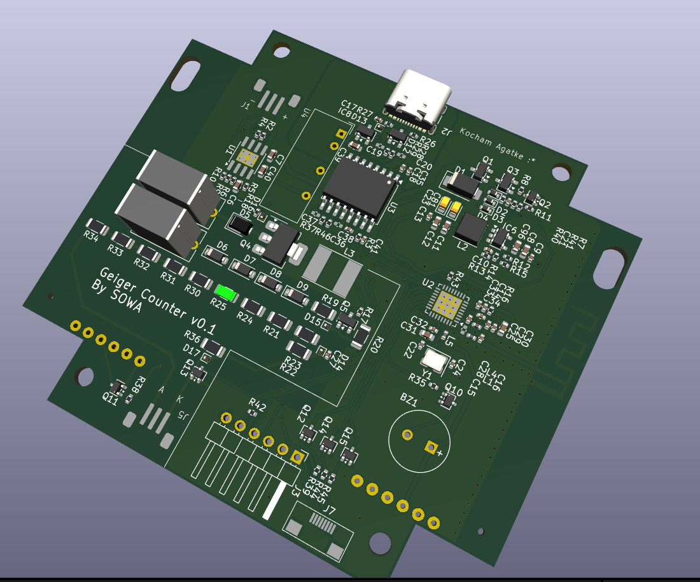

# MQTT Geiger Counter - Hardware Repository

This repository contains the hardware design files for a Geiger counter project.

## 3D Preview

## Scope

- Hardware only: KiCad projects, fabrication outputs, and assembly files.
- Firmware/software is intentionally managed separately from this hardware snapshot.

## Repository Structure

The project is organized as three PCB blocks:

1. `Mainboard/`
   - Main KiCad project and schematic hierarchy (`Project/`)
   - Production outputs (`Production/Gerber/`, `Production/Assembly/`)
   - Supporting datasheets (`Datasheets/`)

2. `Sensor PCB/`
   - Sensor board KiCad project (`sensor/`)
   - Production gerbers (`Production/Gerbers/`)

3. `Button PCB/`
   - Touch/button board KiCad project (`Buttons PCB/`)
   - Production data (`Production/Gerbers/`, `Production/Assembly/`)

## Commit Organization

- Hardware can be kept as one baseline commit containing all three PCB trees.
- Firmware/software history is separate and should stay in a different commit line or repository.

## Tooling

- Primary EDA tool: KiCad (project, schematic, PCB, symbol, and footprint files).
